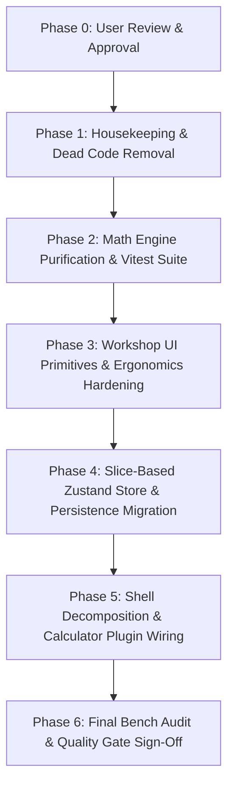

# R4 Investigation Report: Component Structure, Scalability, & Workshop Architecture

> **Universal Wet Grinder Angle Setter (UWGAS)**  
> **Investigation Domain**: R4: Component Structure & Scalability Analysis  
> **Author**: Explorer Agent (`teamwork_preview_explorer_components_arch`)  
> **Status**: Completed Analysis — Awaiting User Approval Prior to Implementation

---

## Executive Summary

The UWGAS frontend currently operates as a classic monolithic "God Component" architecture centered around `src/App.tsx` (758 lines, 20+ pieces of state, and up to 22 drilled props per branch), with severe presentation-vs-calculation bleed between UI components and the pure math engine (`src/math/tormek.ts`). Modals suffer from fragmented lifecycle management with hardcoded animation timeouts, lack mandatory keyboard dismissal (`Escape`), and breach workshop touch ergonomics ($\ge 44\text{px}$) and iOS Safari scroll container constraints. 

To support new sharpening modalities (Belt Grinders, Freehand / Paper Wheels, and specialized Knife/Scissor Jigs) without bloat, the architecture must transition to a **Pluggable Calculator Plugin Pattern** backed by a **Slice-Based Zustand Store**, an **Ironclad 4-Tier Layering Model** that isolates pure trigonometry, and a **Shared Workshop UI Primitives Library** enforcing physical shop ergonomics. The proposed `implementation_plan.md` is sound in choosing Zustand over React Context, but **MUST BE SIGNIFICANTLY MODIFIED** to avoid replacing a monolithic component with an equally brittle monolithic store.

---

## 1. Observation

### 1.1 The "God Orchestrator" (`App.tsx`) & Prop Drilling Cascade
Direct inspection of `src/App.tsx` reveals that it directly manages all application lifecycle, navigation, dialogs, persistence, and state orchestration:
- **State Sprawl (Lines 53–75, 94–198)**:
  - Domain state: `global`, `machines`, `defaultMachineId`, `jigs`, `usbs`, `wheels`, `sessionSteps`, `sessionPresets`, `heightMode`.
  - Ephemeral UI state: `view`, `settingsView`, `isConfirmingClear`, `isSetupPanelOpen`, `selectedPresetId`, `isPresetDialogOpen`, `isPresetDialogClosing`, `presetNameDraft`, `isPresetManagerOpen`, `isPresetManagerClosing`, `exportSections`, `importSections`, `importModes`.
- **Prop Drilling Severity**:
  - `GlobalSetupCard` (`src/App.tsx:432-451`, `src/components/calculator/GlobalSetupCard.tsx:10-30`): receives **18 props**, including raw callbacks, dispatchers, arrays, and flags.
  - `ProgressionView` (`src/App.tsx:540-555`, `src/components/ProgressionView.tsx:6-23`): receives **16 props**, and then forwards **22 props** into each individual `StepCard` (`ProgressionView.tsx:25-46, 48-69`).
  - `MachineManagerView` (`src/App.tsx:625-635`): receives **8 props**.
  - `HardwareManagerView` (`src/App.tsx:602-611`): receives **8 props**.
  - `ImportExportPanel` (`src/App.tsx:650-664`): receives **8 props**.
- **Entangled Business & IO Logic in `App.tsx`**:
  - Auto-save side-effect (`App.tsx:77-90`): An unbounded `useEffect` serializes the entire 10-property state tree to `localStorage` on every keystroke or state change.
  - Import JSON parser & merge engine (`App.tsx:328-413`): 85 lines of raw object traversal, map-by-ID deduplication, and conditional section branching directly embedded inside the root component.
  - Progression calculation invocation (`App.tsx:207-210`): Directly executes the full progression solve via `useMemo` dependent on 7 different top-level arrays and objects.

### 1.2 Presentation vs. Calculation Bleed & Erosion of Math Purity
- **UI View-Model Logic Embedded in Sacred Math Engine (`src/math/tormek.ts:154-348`)**:
  - `computeWheelResults` accepts UI entity types (`wheels: Wheel[]`, `sessionSteps: SessionStep[]`, `global: GlobalState`, `machines: MachineConfig[]`, `jigs: JigConfig[]`, `usbs: UsbConfig[]`).
  - Formats user-facing orientation strings directly inside math file:
    ```typescript
    // src/math/tormek.ts:212-214
    const orientationLabel = baseForHn === 'rear'
      ? 'Edge leading (rear base)'
      : 'Edge trailing (front base)';
    ```
  - Calculates UI turn instructions and thread pitch offsets:
    ```typescript
    // src/math/tormek.ts:261-268
    if (global.useProtrusionMode && global.protrusion !== undefined && activeJig.isAdjustableLength && activeJig.length) {
       const requiredJigLength = projOutput.A - global.protrusion;
       requiredJigAdjustmentMm = requiredJigLength - activeJig.length;
       if (activeJig.threadPitch) {
           requiredJigTurns = requiredJigAdjustmentMm / activeJig.threadPitch;
       }
    }
    ```
  - Performs step-by-step carry-over angle math for the UI (`lines 318-345`).
- **Mathematical Calculations Embedded Directly Inside Presentation Components**:
  - In `src/components/ProgressionView.tsx:108-140` (`StepCard`), trigonometric delta math, turn conversions, and micro-adjust calculations are performed directly during render:
    ```typescript
    // src/components/ProgressionView.tsx:114-127
    const diff = currH - prevH;
    if (Math.abs(diff) >= 0.01) {
      deltaText = `Δ ${diff > 0 ? '+' : ''}${diff.toFixed(2)} MM`;
      if (effectiveUsb?.threadPitch) {
        const turns = Math.abs(diff) / effectiveUsb.threadPitch;
        if (effectiveUsb.microAdjustMarks) {
          const fullTurns = Math.floor(turns);
          const marks = Math.round((turns - fullTurns) * effectiveUsb.microAdjustMarks);
          ...
    ```
  - In `src/components/calculator/GlobalSetupCard.tsx:62-67`, the component directly invokes `computeSuggestedFrontUsbHeight(...)` during render and embeds numerical stepping rounding formulas (`Math.round((current + delta) * 10) / 10`).
  - In `src/components/CalibrationWizard.tsx:103-145`, measurement estimation math creates dummy machine objects and invokes `estimateMaxAngleErrorDeg(...)` inline.

### 1.3 Modal Fragmentation, Accessibility Deficits, & DOM Hacking
- **Hardcoded Timeout Delays & Fragmented Lifecycle**:
  - Modals reinvent their own closing timers with conflicting intervals:
    - `src/components/wheels/WheelManagerView.tsx:71, 99`: `window.setTimeout(..., 200)`
    - `src/App.tsx:691, 712`: `setTimeout(..., 200)`
    - `src/components/MiniSelect.tsx:87`: `window.setTimeout(..., 160)`
    - `src/components/calculator/ActionSheetPicker.tsx:33`: `setTimeout(onClose, 250)`
- **Accessibility Deficit: Zero Keyboard Dismissal (`Escape`)**:
  - `AGENTS.md` mandates: *"Full keyboard modal dismissal."*
  - `docs/DEVELOPMENT_GUIDE.md:93` mandates: *"Ensure all modal views listen to Escape key and click-outside dismissal (via useModalLayout)."*
  - Neither `src/components/ModalShell.tsx` nor `src/hooks/useModalLayout.ts` has ANY `Escape` key event listener or focus trapping.
  - Across the entire project, only `src/components/presets/PresetManagerModal.tsx:100` checks `e.key === 'Escape'`, and only inside an inline rename text input field.
- **Direct DOM Manipulation in `MiniSelect.tsx:38-63`**:
  - `MiniSelect` manipulates ancestor container styling to avoid dropdown clipping:
    ```typescript
    // src/components/MiniSelect.tsx:42-53
    const hostCard = rootRef.current?.closest<HTMLElement>('.card-elevated, .bg-\\[\\#262626\\]');
    const hostPanel = rootRef.current?.closest<HTMLElement>('.panel-card, .bg-\\[\\#262626\\]');
    ...
    el.style.zIndex = '3000';
    el.style.overflow = 'visible';
    ```
  - Direct style mutation breaks CSS encapsulation and causes unexpected layout jump during scrolling.

### 1.4 Workshop Ergonomics Violations (`AGENTS.md`)
- **Interactive Touch Targets Below $44\text{px} \times 44\text{px}$**:
  - `src/components/ModalShell.tsx:53`: Modal close button is styled `w-10 h-10 sm:w-11 sm:h-11` (40px on mobile).
  - `src/App.tsx:461, 475, 490, 506`: Header action buttons ("Clear All", "+ Add Step", "No", "Yes") are `h-9` (36px).
  - `src/components/settings/MachineManagerView.tsx:186, 194`: Machine edit and delete buttons are `w-10 h-10` (40px).
  - `src/components/settings/HardwareManagerView.tsx:132`: Jig/USB delete button is `w-10 h-10` (40px).
  - `src/components/wheels/WheelManagerView.tsx:181, 189`: Wheel edit and delete buttons are `w-10 h-10` (40px).
  - `src/components/ImportExportPanel.tsx:44`: Section collapse toggle is `w-10 h-10` (40px).
- **Missing Safari Scroll Spacers**:
  - `AGENTS.md:43-44` mandates: *"Never rely on padding-bottom (e.g., pb-6) on overflow-y-auto containers... always append an invisible spacer block as the final child inside the scroll container."*
  - Missing spacer violations identified:
    - `src/components/calculator/ActionSheetPicker.tsx:63`: relies on `pb-6` on `overflow-y-auto` container without spacer.
    - `src/components/ModalShell.tsx:37`: uses `max-h-[90vh] overflow-y-auto p-6` without spacer.
    - `src/components/presets/PresetManagerModal.tsx:62`: uses `max-h-[60vh] overflow-y-auto` without spacer.
    - `src/components/settings/HardwareManagerView.tsx:84`: uses `overflow-y-auto p-5 sm:p-6` without spacer.

### 1.5 Orphaned, Dead, & Leftover Artifacts
- `src/ui/buttons.ts` (17 lines) and `src/primitives.css:18-207` (190 lines): Defines `.u-btn` classes that are completely unused; all components use ad-hoc inline Tailwind strings.
- `src/components/GrindDirToggle.tsx` (74 lines): Completely unreferenced and orphaned.
- `src/components/ExpandToggle.tsx` (42 lines): Completely unreferenced; `ImportExportPanel.tsx` created an inferior duplicate `CollapseToggle`.
- `src/state/useAppState.ts` (249 lines): Completely unreferenced legacy state hook.
- `src/math/tormek.cjs` (431 lines) and `src/types/core.js` (110 lines): Leftover compiled artifacts polluting `src/`.

---

## 2. Logic Chain

### Step 1: Why the God Component Pattern Degrades Performance & Scalability
- **Observation**: `App.tsx` holds 20+ state hooks and passes them down up to 4 component tiers.
- **Reasoning**:
  1. In React, whenever state updates inside a component, that component and all its un-memoized descendants re-render.
  2. Because `App.tsx` houses transient UI state (e.g. `isSetupPanelOpen`, `presetNameDraft`, `isConfirmingClear`), toggling a drawer or typing in a preset name triggers a render of `App.tsx`.
  3. This invalidates memoization across the tree, causing `GlobalSetupCard`, `ProgressionView`, and navigation controls to re-render needlessly.
  4. Adding a new calculator (e.g., Belt Grinder) under this paradigm would require adding another 10+ state variables and handlers directly into `App.tsx`, causing exponential code sprawl and high risk of regressions.

### Step 2: Why Presentation Bleed Destroys Math Isolation
- **Observation**: `computeWheelResults` in `tormek.ts` processes UI types, while `StepCard` in `ProgressionView.tsx` computes thread pitch delta turns.
- **Reasoning**:
  1. Dutchman / Ton trigonometry is a closed-form geometric formulation. Its correctness depends strictly on pure geometric inputs ($D_w, A, \beta, D_j, D_s, h_c, o$).
  2. By embedding UI types (`GlobalState`, `SessionStep`, `Wheel`) into `tormek.ts`, any schema modification (such as adding multi-machine profiles, custom abrasive types, or belt angles) forces modifications to `tormek.ts`.
  3. Scattering math calculations into UI components (`StepCard`, `GlobalSetupCard`) means calculations cannot be verified via automated CLI test runners (e.g. Vitest golden-master tests) without mocking DOM and React lifecycle.
  4. Therefore, an ironclad architectural boundary requires moving view-model adaptation into dedicated calculator adapters, leaving `tormek.ts` 100% pure.

### Step 3: Why Modal Inconsistency and Ergonomics Violations Hurt Workshop Usability
- **Observation**: Modals lack `Escape` listeners, use inconsistent timeouts, and feature 36px–40px buttons.
- **Reasoning**:
  1. A workshop angle setter is operated with wet, dusty, or gloved hands at a grinding station.
  2. Sub-44px touch targets (e.g., 36px header buttons or 40px modal close icons) cause mis-taps and operator frustration.
  3. When an operator hits physical `Escape` on an attached bench keyboard or bluetooth pedal, open dialogs fail to close because keyboard events are ignored.
  4. On mobile iOS Safari, lack of scroll spacer blocks causes the lowest options in action sheets and modals to be trapped beneath Safari's dynamic URL bar.
  5. Therefore, modal lifecycles and touch targets must be unified into accessible, ergonomic shared UI primitives.

### Step 4: Critique & Evaluation of `implementation_plan.md`
- **Observation**: `implementation_plan.md` suggests migrating state to a single Zustand store in `src/state/store.ts`, removing `App.tsx` state, and deleting `useAppState.ts`.
- **Reasoning**:
  1. *State Manager Verdict*: **Zustand is the correct tool**. React's Context API triggers re-renders on all consumers whenever any slice of context updates, requiring complex context-splitting or memoization wrappers. Zustand allows fine-grained atomic selectors (`useStore(s => s.targetAngle)`) so components only render when their subscribed data changes.
  2. *Architectural Flaw in Plan*: The plan replaces a "God Component" with a "God Store". Putting all UI drawer toggles, import/export modes, hardware configs, and calculation results into a single file (`store.ts`) re-creates the monolith in the state layer.
  3. *Omission of Math Isolation*: The plan completely ignores `src/math/tormek.ts:computeWheelResults`.
  4. *Omission of Calculator Plug-in Scalability*: The plan does not define how new sharpening tools will integrate without modifying existing components.
  5. *Storage Hazard*: The plan leaves the persistence strategy open. A naive switch to Zustand's standard `persist` middleware without preserving `storage.ts` schema migrations (`PERSIST_VERSION = 5`) and JSON backup compatibility risks wiping existing user data.
  6. *Verdict*: **MODIFY SIGNIFICANTLY**.

---

## 3. Recommended Architecture: The Pluggable Calculator Pattern

### 3.1 The 4-Tier Layering Model

```
┌────────────────────────────────────────────────────────┐
│  Tier 4: Layout & Views                                │
│  AppShell, CalculatorView, WheelsView, SettingsViews   │
└───────────────────────────┬────────────────────────────┘
                            │
┌───────────────────────────▼────────────────────────────┐
│  Tier 3: Shared Workshop UI Primitives                 │
│  Modal, ActionSheet, Stepper (≥44px), Safari Spacers  │
└───────────────────────────┬────────────────────────────┘
                            │
┌───────────────────────────▼────────────────────────────┐
│  Tier 2: Pluggable Calculator Modules                  │
│  CalculatorPlugin Contract, WetGrinder, BeltGrinder    │
│  (View-Model Adapters, Step Cards, Setup Drawers)      │
└───────────────────────────┬────────────────────────────┘
                            │
┌───────────────────────────▼────────────────────────────┐
│  Tier 1: Sacred Pure Math Engines                      │
│  tormek/geometry.ts, tormek/calibration.ts             │
│  (100% Pure Functions, Scalar Inputs, Zero UI Types)   │
└────────────────────────────────────────────────────────┘
```

### 3.2 Tier 1: Sacred Pure Math Engine (`src/math/`)
- **Strict Isolation Contract**:
  - Zero imports from `src/types/core.ts` containing UI state (`GlobalState`, `SessionStep`, `Wheel`, `MachineConfig`).
  - Inputs must be pure mathematical primitives:
    ```typescript
    export type PureTonInput = {
      base: 'rear' | 'front';
      D: number;               // Wheel diameter (mm)
      A: number;               // Projection (mm)
      betaDeg: number;         // Target angle (deg)
      Dj: number;              // Jig diameter (mm)
      Ds: number;              // USB diameter (mm)
      constants: {
        rear: { hc: number; o: number };
        front: { hc: number; o: number };
      };
      angleOffsetDeg?: number;
    };
    ```
  - Functions in `src/math/`:
    - `computeTonHeights(input: PureTonInput): PureTonOutput`
    - `computeRequiredProjection(input: PureProjectionInput): PureProjectionOutput`
    - `computeSuggestedFrontUsbHeight(...)`
    - `calibrateBase(...)`
    - `estimateMaxAngleErrorDeg(...)`
    - `solveBetaForFixedSetup(...)`
  - Completely decoupled from React and local storage; 100% testable via CLI Vitest scripts.

### 3.3 Tier 2: Calculator Plug-in Contract (`src/calculators/types.ts`)
To accommodate new calculators (e.g. Belt Grinders, Paper Wheels, Scissor Jigs) without touching `App.tsx`:

```typescript
export interface CalculatorPlugin<TSetup, TStepInput, TStepResult> {
  id: string;                                   // e.g. 'tormek-wet-grinder'
  name: string;                                 // e.g. 'Tormek / Wet Grinder'
  icon: React.ComponentType<{ className?: string }>;
  description: string;

  // View Components
  SetupDrawerComponent: React.ComponentType<{
    isOpen: boolean;
    onClose: () => void;
  }>;
  StepCardComponent: React.ComponentType<{
    result: TStepResult;
    step: TStepInput;
    index: number;
    prevResult?: TStepResult;
  }>;

  // Domain Calculation Adapter (Pure function converting state slices to results)
  calculateProgression: (
    steps: TStepInput[],
    setup: TSetup,
    hardware: HardwareState
  ) => TStepResult[];
}
```

### 3.4 Tier 3: Shared Workshop UI Primitives (`src/ui/`)
All workshop interactive elements must be encapsulated in `src/ui/` with guaranteed compliance:

| Component | Ergonomic & Technical Guarantee | Replaces |
| :--- | :--- | :--- |
| `src/ui/Modal.tsx` | Auto-dismiss on `Escape`, click-outside, focus trap, built-in 1px Safari spacer, smooth CSS transitions. | Fragmented timeouts in `ModalShell`, `WheelManagerView`, `MachineManagerView` |
| `src/ui/ActionSheet.tsx` | Mobile slide-up sheet, $\ge 48\text{px}$ row targets, safe area inset handling, built-in Safari spacer. | `ActionSheetPicker.tsx` |
| `src/ui/Stepper.tsx` | Standardized $+/-$ steppers ($\ge 44\text{px} \times 44\text{px}$, haptic active scales). | Inline button groups in `GlobalSetupCard.tsx` |
| `src/ui/ScrollContainer.tsx`| Wraps `overflow-y-auto` and automatically appends `<div className="h-px shrink-0 w-full" />`. | Ad-hoc `overflow-y-auto` divs |
| `src/ui/SegmentedControl.tsx`| Accessible toggle pill ($h_n \leftrightarrow h_r$, Jigs $\leftrightarrow$ USBs, Front $\leftrightarrow$ Rear). | Inline flex button toggles |
| `src/ui/LargeNumberInput.tsx`| Massive high-contrast monospace input with `blurOnEnter` and auto-select on focus. | Inline inputs across forms |

### 3.5 Tier 4: Store Slices & State Architecture (`src/state/`)
Instead of a single monolithic store, decompose into domain slices:
```
src/state/
├── store.ts              # Root store aggregating slices with Zustand persist middleware
├── slices/
│   ├── calculatorSlice.ts # activeCalculatorId, targetAngle, projection, heightMode, steps
│   ├── hardwareSlice.ts   # machines, usbs, jigs, activeMachineId
│   ├── wheelSlice.ts      # wheels catalog, sorting, filters
│   ├── presetSlice.ts     # sessionPresets, activePresetId
│   └── uiSlice.ts         # activeView ('calculator' | 'wheels' | 'settings'), activeModals
├── storage.ts             # Custom storage engine keeping PERSIST_VERSION=5 and migrations
└── importExport.ts        # JSON export, schema validation, and merge strategies
```

---

## 4. Phased Implementation Roadmap & Verification Gates

> [!IMPORTANT]
> **User Approval Gate**: In accordance with project instructions, **NO SOURCE CODE MODIFICATIONS** will be executed until the user has formally reviewed and authorized this phased roadmap.



### Phase 1: Housekeeping & Dead Code Removal
- **Scope**:
  1. Delete orphaned source files: `src/components/GrindDirToggle.tsx`, `src/components/ExpandToggle.tsx`, `src/state/useAppState.ts`, `src/ui/buttons.ts`.
  2. Remove unused CSS blocks from `src/primitives.css` (`.u-btn` classes).
  3. Purge leftover transpiled artifacts from `src/`: `src/math/tormek.cjs` and `src/types/core.js`.
  4. Replace `CollapseToggle` in `src/components/ImportExportPanel.tsx` with standard icons.
- **Verification Gate**:
  - `npm run typecheck` passes with 0 errors.
  - `npm run lint` passes with 0 errors.
  - `npm run build` succeeds cleanly.

### Phase 2: Math Engine Purification & Vitest Suite (`JOB-009`)
- **Scope**:
  1. Extract view-model logic out of `src/math/tormek.ts`:
     - Move `computeWheelResults` into `src/calculators/wet-grinder/adapter.ts`.
     - Remove all UI dependencies (`GlobalState`, `SessionStep`, `Wheel`, `MachineConfig`) from `src/math/tormek.ts`.
  2. Move pure thread-pitch turns calculations out of `ProgressionView.tsx` into the wet grinder adapter.
  3. Implement golden-master Vitest test suite (`src/math/__tests__/tormek.test.ts`) verifying canonical Dutchman spreadsheet tables ([`docs/MATH_REFERENCE.md`](docs/MATH_REFERENCE.md)).
- **Verification Gate**:
  - `npm run test` passes 100% of mathematical test vectors.
  - Math engine contains zero React, DOM, or UI type imports.

### Phase 3: Workshop UI Primitives & Ergonomics Hardening (`JOB-011`)
- **Scope**:
  1. Create `src/ui/Modal.tsx` with unified open/close transition, focus trap, `Escape` key listener, and Safari scroll spacer.
  2. Create `src/ui/ActionSheet.tsx` with $\ge 48\text{px}$ button heights and built-in scroll spacer.
  3. Create `src/ui/Stepper.tsx` with guaranteed $\ge 44\text{px} \times 44\text{px}$ touch targets.
  4. Refactor `ModalShell.tsx`, `ActionSheetPicker.tsx`, and `MiniSelect.tsx` to use these primitives.
  5. Fix all sub-44px touch targets across `App.tsx` (change `h-9` buttons to `h-11`), `MachineManagerView.tsx`, `HardwareManagerView.tsx`, and `WheelManagerView.tsx`.
- **Verification Gate**:
  - Responsive audit at 360px and 390px viewports (zero horizontal overflow, zero wrapping).
  - All interactive buttons meet or exceed $44\text{px} \times 44\text{px}$.
  - Modal dismissal verified via `Escape` key and backdrop click.

### Phase 4: Slice-Based Zustand Store & Persistence Migration
- **Scope**:
  1. Install `zustand` (`npm install zustand`).
  2. Implement sliced store in `src/state/` (`calculatorSlice`, `hardwareSlice`, `wheelSlice`, `presetSlice`, `uiSlice`).
  3. Connect Zustand `persist` middleware with existing `src/state/storage.ts` engine, guaranteeing seamless backward compatibility with schema `version: 5`.
  4. Extract import/export parsing logic into `src/state/importExport.ts`.
- **Verification Gate**:
  - Existing local storage data loads without loss or reset.
  - JSON import/export round-trip test verifies full state restoration.
  - `npm run typecheck` passes with 0 errors.

### Phase 5: Shell Decomposition & Calculator Plugin Wiring
- **Scope**:
  1. Decompose `src/App.tsx` from 758 lines down to a clean ~60-line shell orchestrating `AppShell` and top-level views.
  2. Extract `src/views/CalculatorView.tsx`, `src/views/WheelsView.tsx`, and `src/views/SettingsView/`.
  3. Implement the `CalculatorPlugin` interface and register `WetGrinderPlugin`.
  4. Connect components directly to Zustand store slices, eliminating all prop drilling.
- **Verification Gate**:
  - `src/App.tsx` line count reduced by $>85\%$.
  - End-to-end workflow verification: change angle $\beta$, step $A$, switch wheels, save preset, calibrate machine, toggle height mode ($h_n \leftrightarrow h_r$).
  - Zero TypeScript errors, zero ESLint warnings, production build succeeds cleanly.

---

## 5. Caveats

1. **Active Local Storage State**:
   - The user's live browser may contain existing `uwgas_state_v1` data at `version: 5`. Any changes to state structure must preserve existing keys or provide backwards-compatible fallback migration in `_load()`.
2. **CSS Theme System (Tailwind v4)**:
   - The project uses Tailwind CSS v4 with custom CSS variables in `theme.css`, `primitives.css`, and `neumorphic.css`. New UI primitives must utilize existing semantic classes (`neu-button`, `neu-concave`, `bg-[#262626]`, `border-white/10`) to maintain 100% visual parity with `ProgressionView.tsx`.
3. **Vitest Test Runner**:
   - `package.json` currently has `"test": "echo \"(no tests defined yet)\" && exit 0"`. Setting up Vitest for Phase 2 will require adding `vitest` as a devDependency.

---

## 6. Conclusion

The current UWGAS codebase has functional, high-precision trigonometry and an attractive dark-theme aesthetic, but suffers from acute structural debt: an overgrown 758-line root component, deep prop drilling, mathematical bleed into UI components, unstandardized modals with zero keyboard accessibility, and multiple breaches of workshop ergonomics ($\ge 44\text{px}$ targets, Safari scroll spacers).

By adopting the **Pluggable Calculator Architecture**, isolating the **Dutchman / Ton Math Engine** into pure scalar functions, decomposing state into a **Slice-Based Zustand Store**, and establishing **Ergonomic Workshop Primitives**, UWGAS will achieve true professional-grade scalability — enabling new grinding tools (belt grinders, paper wheels, custom jigs) to plug in seamlessly without touching core layout scaffolding.

---

## 7. Verification Method

To independently verify all findings and validate this report against the codebase:

1. **Verify Line Counts & Code Sprawl**:
   ```bash
   wc -l src/App.tsx src/components/CalibrationWizard.tsx src/components/calculator/GlobalSetupCard.tsx src/components/ProgressionView.tsx
   ```
2. **Verify Sub-44px Touch Targets**:
   ```bash
   grep -n "h-9" src/App.tsx
   grep -n "w-10 h-10" src/components/ModalShell.tsx src/components/settings/MachineManagerView.tsx src/components/settings/HardwareManagerView.tsx src/components/wheels/WheelManagerView.tsx
   ```
3. **Verify Lack of Keyboard Dismissal (`Escape`)**:
   ```bash
   grep -ri "Escape" src/
   # Notice that only PresetManagerModal.tsx has an inline Escape check in a rename input.
   ```
4. **Verify Presentation Bleed in Math Engine**:
   ```bash
   grep -n "orientationLabel" src/math/tormek.ts
   grep -n "requiredJigTurns" src/math/tormek.ts
   ```
5. **Verify Dead & Orphaned Files**:
   ```bash
   ls -l src/math/tormek.cjs src/types/core.js src/state/useAppState.ts src/components/GrindDirToggle.tsx src/components/ExpandToggle.tsx
   ```
6. **Verify Baseline Code Quality Gates**:
   ```bash
   npm run typecheck
   npm run lint
   npm run build
   ```

