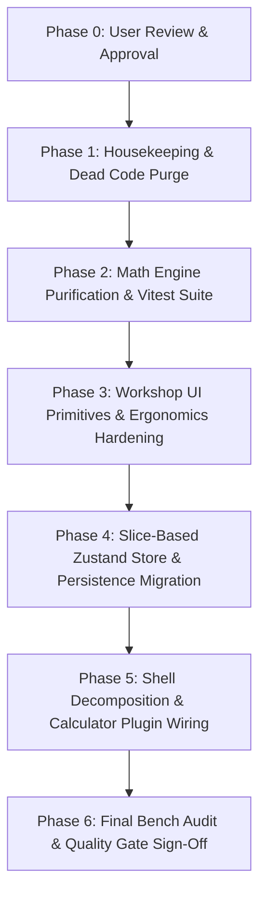

# Universal Wet Grinder Angle Setter (UWGAS)
## Comprehensive Architecture Audit, Refactoring Plan Verification, & Sacred Math Engine Isolation Strategy

**Mission Owner**: Project Orchestrator (`teamwork_preview_orchestrator_2`)  
**Project Root**: `/home/jordancarruthers/Documents/GitHub/uwgas/angle-setter`  
**Date**: 2026-09-07  
**Status**: Completed Architectural Audit — Ready for User Approval Prior to Implementation  

---

## Executive Summary & Definitive Verdict

| Domain | Assessment | Summary Verdict / Strategic Recommendation |
| :--- | :--- | :--- |
| **R1. Codebase Audit ("The Roast")** | **Critical Debt** | `src/App.tsx` (759 lines) acts as a monolithic "God Component" coordinating 22+ state hooks, 18 unmemoized handlers, 18-to-22 prop-drilling pathways, direct DOM class selector sniffing, and an out-of-band `CustomEvent("collapseAll")` event bus. |
| **R2. Refactoring Plan Verification** | **MODIFY SIGNIFICANTLY** | `.agents/implementation_plan.md` is correct in choosing Zustand over React Context, but replaces a "God Component" with a "God Store", completely omits the derived math calculation pipeline, lacks atomic selector hygiene, ignores legacy storage migrations (data loss hazard), and misses React 19 compatibility. |
| **R3. User Data Storage Audit** | **High Fragility** | `src/state/storage.ts` triggers up to 11 consecutive synchronous `localStorage` writes on every render tick and mount (50–100ms thread stall), discards `version` so data is version-less, silently swallows errors, serializes `NaN` to `null` which coerces wheel diameters to `0 mm`, and contains dead normalizer code. |
| **R4. Component Scalability & UX** | **Structural Debt** | Severe presentation vs. calculation bleed; modals lack mandatory `Escape` keyboard dismissal (`AGENTS.md`); touch targets violate the $\ge 44\text{px}$ threshold (36px–40px buttons); missing Safari scroll spacers; leftover dead code and transpiled artifacts polluting `src/`. Recommended: **4-Tier Pluggable Calculator Architecture**. |
| **R5. Sacred Math Engine Isolation** | **Boundary Violation** | `computeWheelResults` inside `src/math/tormek.ts` couples pure trigonometry to UI models (`GlobalState`, `SessionStep`, `Wheel`) and UI text formatting. Recommended: **Two-Tier Model** isolating a pure mathematical core (`Readonly<T>`, runtime guards, `Object.freeze`, ESLint restricted imports, zero UI types) from an application calculation adapter. |

---

## R1. Codebase Audit ("The Roast")

An exhaustive audit of `src/App.tsx` and connected components reveals five distinct architectural flaws and anti-patterns:

### 1. The Monolithic "God Component" (`src/App.tsx:51-758`)
- **Concrete Code Citations**: `App.tsx:54-74, 94, 128, 137, 140, 164-170, 173-198`.
- **The Anti-Pattern**: `App.tsx` coordinates 22 distinct `useState` hooks across 759 lines of code. It acts simultaneously as the domain state repository, UI router, modal manager, layout observer, persistence coordinator, global DOM listener, and JSON import/export parser.
- **Performance Impact**: Any state modification (e.g. typing a draft preset name in `presetNameDraft`, or expanding a settings panel) forces the entire 759-line root component function and its virtual DOM tree to re-execute, allocating dozens of closures and intermediate arrays on every keystroke.
- **Maintainability Impact**: The project currently has **0 automated tests** (`package.json:13`: `"echo \"(no tests defined yet)\"`). Testing `App.tsx` in isolation is impossible without mocking `window`, `document.addEventListener`, `ResizeObserver`, `localStorage`, and custom browser events.

### 2. The "Prop Drilling Abyss" & Hierarchical Coupling
- **Concrete Code Citations**: `App.tsx:432-451` (18 props to `GlobalSetupCard`), `App.tsx:540-555` (16 props to `ProgressionView`), `ProgressionView.tsx:383-406` (22 props drilled into every `StepCard`).
- **The Anti-Pattern**: Intermediate components function as passive couriers. Leaf components receive raw React `Dispatch<SetStateAction<...>>` setters (e.g., `setGlobal`, `setDefaultMachineId`) rather than intention-revealing domain actions.
- **Performance Impact**: When a user tweaks target angle $\beta$ or projection $A$, `App` re-renders. Because `ProgressionView` receives a new array and new function references, it diffs and re-renders every single `StepCard` in a loop. Furthermore, inside each `StepCard` render (`ProgressionView.tsx:96-103`), `.find()` is called on `machines`, `usbs`, and `jigs`, turning every top-level state change into an $O(\text{Steps} \times \text{Machines})$ lookup cascade.
- **Maintainability Impact**: Adding a new hardware setting (e.g., micro-adjust thread pitch or calibration profile) requires modifying TypeScript prop interfaces across 5 separate files (`types/core.ts`, `App.tsx`, `ProgressionView.tsx`, `StepCardProps`, `GlobalSetupCard.tsx`).

### 3. Referential Instability & Closure Allocations
- **Concrete Code Citations**: `App.tsx:212-310` (18 unmemoized handlers), `App.tsx:438-443, 630-633, 688-694` (inline JSX arrow functions).
- **The Anti-Pattern**: 18 CRUD handlers (`handleAddWheel`, `handleUpdateJig`, `handleDeleteStep`, `handleSavePreset`, etc.) are declared without `useCallback`. Props are passed as inline arrow functions (`onSelectPreset={(p) => { ... }}`).
- **Performance Impact**: Every function literal evaluated during render creates a new object in memory with a unique reference address. This **100% defeats `React.memo`** in child components. During continuous touch gestures (dragging an angle slider or micro-stepping), this creates massive V8 garbage collection churn, producing visible stutter and dropped frames on mobile devices.
- **Maintainability Impact**: Closures capturing state inside asynchronous timeouts (`App.tsx:690, 710`) can execute against stale state if rapid interactions occur within the 200ms animation window.

### 4. Out-of-Band Imperative Event Bus & Brute-Force DOM Querying
- **Concrete Code Citations**: `App.tsx:132-134, 141-145`, `ProgressionView.tsx:361-365`, `App.tsx:147-161`.
- **The Anti-Pattern**: Rather than using declarative state, `App.tsx` synchronizes UI card collapse via untyped browser events: `window.dispatchEvent(new CustomEvent("collapseAll"))`. Furthermore, click-outside dismissal relies on `document.addEventListener('pointerdown')` running a string-based CSS query:
  ```typescript
  const isInteractive = target.closest(
    '#global-setup-card, .motion-list-item, .bg-\\[\\#262626\\], .bg-neutral-900, .action-sheet, button, input, select, [role="dialog"]'
  );
  ```
- **Performance Impact**: Every single pointer event runs `target.closest(...)` against an 8-selector CSS string on the main thread before gesture processing begins.
- **Maintainability Impact**: If a developer renames `.bg-[#262626]` to a semantic utility (e.g. `bg-surface`), the click-outside collapse mechanism silently breaks without any compile-time or lint warning.

### 5. Math Invalidation via Cosmetic UI Toggles
- **Concrete Code Citations**: `App.tsx:207-210`, `types/core.ts:40`.
- **The Anti-Pattern**: The visual UI toggle `showAdvancedStepOverrides` is co-located inside `GlobalState`. `App.tsx` wraps `computeWheelResults` in a `useMemo` dependent on the `global` object.
- **Performance Impact**: Toggling this cosmetic UI disclosure switch invalidates the memoization dependency and re-executes Dutchman trigonometry calculations for all wheels, running the law of cosines unnecessarily.

---

## R2. Refactoring Plan Verification (`.agents/implementation_plan.md`)

### Definitive Verdict: **MODIFY SIGNIFICANTLY (Substantial Structural Overhaul Required)**

While the intention in `.agents/implementation_plan.md` to adopt Zustand and eliminate `App.tsx` prop drilling is sound, the drafted plan introduces severe architectural liabilities that must be corrected before implementation:

### Detailed Plan Evaluation & Deficiencies:

1. **The "God Store" Anti-Pattern**:
   - *Plan Proposal*: Lines 30–33 propose dumping `global`, `machines`, `jigs`, `usbs`, `wheels`, `sessionSteps`, `sessionPresets`, `heightMode`, and ephemeral `UI/View states` into a single monolithic `src/state/store.ts`.
   - *Flaw*: This simply moves the 22-state monolith from React to Zustand. Persisting transient UI states (active tab, modal open flags) into localStorage causes dirty reloads and unexpected UI jumps.
   - *Required Correction*: Implement a **Modular Slice Architecture** (`calculatorSlice`, `progressionSlice`, `machineSlice`, `hardwareSlice`, `wheelSlice`, `presetSlice`, `settingsSlice`) in `src/state/slices/` and separate ephemeral UI navigation state into an unpersisted `useUIStore.ts`.

2. **Complete Omission of the Math Calculation Pipeline**:
   - *Plan Proposal*: The words `computeWheelResults`, `wheelResults`, or `math` appear **zero times** in the plan.
   - *Flaw*: The plan fails to define where and how progression results are calculated, memoized, or subscribed to.
   - *Required Correction*: Introduce a dedicated **Application Calculation Service** (`src/services/calculationService.ts`) exposing a clean custom hook (`useWheelResults()`) that subscribes to state slices via `useShallow` and calls the pure math engine.

3. **Absence of Atomic Selector Hygiene**:
   - *Plan Proposal*: Line 50 instructs `GlobalSetupCard.tsx` to *"Implement useStore() hooks to grab the exact data and actions it needs"*.
   - *Flaw*: In Zustand, invoking `useStore()` without selectors causes the component to re-render whenever *any* property in the entire store updates.
   - *Required Correction*: Enforce atomic selectors (`useAppStore(s => s.global.targetAngle)`) and `useShallow` for multi-property subscriptions.

4. **Persistence & Migration Blindspot**:
   - *Plan Proposal*: Under *Open Questions* (line 15), the plan asks: *"Should we migrate to the Zustand persist middleware, or keep the existing custom storage.ts logic for now to minimize risk?"*
   - *Flaw*: Slapping on standard Zustand `persist` would immediately wipe out user setups because the existing application stores data across 11 discrete `t_*` keys with active schema migrations (`PERSIST_VERSION = 6`).
   - *Required Correction*: Implement a **Legacy LocalStorage Migration Bridge** (`src/state/migration.ts`) that reads existing `t_*` keys into the Zustand store on first boot if the unified key (`uwgas-store-v6`) does not yet exist.

5. **React 19 Compatibility Omission**:
   - *Plan Proposal*: Specifies `npm install zustand` without version constraints.
   - *Flaw*: `package.json` uses React `^19.2.0`. Zustand v4 generates peer dependency warnings and has known tearing issues with React 19 concurrent features.
   - *Required Correction*: Explicitly specify **Zustand v5 (`zustand@^5.0.0`)**, which natively supports React 19's `useSyncExternalStore`.

---

## R3. User Data Storage Audit (`src/state/storage.ts`)

Inspection of `src/state/storage.ts` and `App.tsx:77-90` reveals seven critical persistence vulnerabilities:

1. **Synchronous Main-Thread Blocking (`storage.ts:140-153`)**:
   - `writePersistedState` triggers up to **11 consecutive synchronous `localStorage.setItem` and `JSON.stringify` calls** on every render tick and on initial mount. On mobile devices (iOS Safari), flash storage disk I/O stalls the main thread for 50ms–100ms, causing severe touch lag.
2. **Missing Version Persistence (The Disappearing Version)**:
   - `storage.ts:15` exports `PERSIST_VERSION = 6`, and `App.tsx:79` hardcodes `version: 5`. However, `writePersistedState` **never saves `state.version` to localStorage** (`_save('t_version', ...)` does not exist). The data stored in users' browsers is completely version-less.
3. **Silent Error Swallowing & Partial Reset Corruption (`storage.ts:23, 34`)**:
   - `_save` silently swallows `QuotaExceededError` (`catch { // ignore }`). If storage fails or one key is corrupted, only that key resets to defaults while others persist. For example, if `t_wheels` fails to parse, wheels reset to defaults while `sessionSteps` retains custom IDs. These orphaned references cause steps to silently vanish from calculations (`tormek.ts:181`: `if (!w) continue;`).
4. **Serialization Hazards & Numeric Corruption**:
   - `JSON.stringify(NaN)` serializes as `null`. `normalizeWheel` sets `D = NaN` for invalid numbers. On reload, `_nz(null, 0)` coerces `null` to `0`, producing degenerate wheel diameters ($D = 0\text{ mm}$) that produce divide-by-zero or negative geometry without errors.
5. **Dead Normalizers (Unused Sanitization Code)**:
   - `normalizeSessionStep` and `normalizeCalibrationSnapshots` in `src/utils/normalizers.ts` are defined but **never called anywhere in the codebase**.
6. **Blind Type Assertions**:
   - `_load<T>` executes `return parsed as T;` with zero runtime schema validation.
7. **Multi-Tab Race Conditions**:
   - No `window.addEventListener('storage')` listener exists. If UWGAS is open in two tabs, changes in Tab 1 are silently overwritten by Tab 2.

### Storage Modernization Architecture:
- **Unified Key & Atomic Persistence**: Consolidate the 11 `t_*` keys into a single envelope key (`uwgas_app_state_v1`).
- **Debounced Writes**: Debounce writes by 300ms to eliminate main-thread blocking during continuous slider/stepper adjustments.
- **Runtime Validation via Zod**: Implement Zod schemas (`WheelSchema`, `MachineConfigSchema`, etc.) with `safeParse` to validate persisted data at runtime.
- **Linear Versioned Migration Pipeline**: Implement explicit migration functions (`migrateV1ToV2`, ..., `migrateV5ToV6`).
- **Multi-Tab Sync**: Listen for browser `storage` events to synchronize state seamlessly across open tabs.

---

## R4. Component Structure & Scalability Analysis

### 1. Presentation vs. Calculation Bleed
- **UI Logic in Math Engine**: `src/math/tormek.ts:154-348` contains `computeWheelResults`, an application adapter that processes UI models, formats orientation strings (`'Edge leading (rear base)'`), and calculates jig collar turns.
- **Math in UI Components**: `ProgressionView.tsx:108-140` (`StepCard`) calculates thread pitch delta turns and micro-adjust marks directly during render. `GlobalSetupCard.tsx:62-67` computes suggested front USB heights during render.

### 2. Monolithic Modals, Inconsistent Lifecycles, & Accessibility Failures
- **Inconsistent Animation Delays**: Modals hardcode conflicting closing timeouts (`160ms` in `MiniSelect`, `200ms` in `App.tsx` and `WheelManagerView`, `250ms` in `ActionSheetPicker`).
- **Zero Keyboard Dismissal (`Escape`)**: Neither `ModalShell.tsx` nor `useModalLayout.ts` has ANY `Escape` key event listener or focus trap, directly violating `AGENTS.md` and `docs/DEVELOPMENT_GUIDE.md:93`.
- **DOM Hacking in `MiniSelect.tsx:38-63`**: `MiniSelect` directly mutates ancestor DOM element styles (`zIndex = '3000'`, `overflow = 'visible'`) rather than using standard popovers/portals.

### 3. Workshop Ergonomics Violations (`AGENTS.md`)
- **Sub-44px Touch Targets**: Header buttons in `App.tsx:461, 475, 490, 506` are `h-9` (36px). Delete and edit buttons in `ModalShell.tsx:53`, `MachineManagerView.tsx:186`, `HardwareManagerView.tsx:132`, and `WheelManagerView.tsx:181` are `w-10 h-10` (40px).
- **Missing Safari Scroll Spacers**: `ActionSheetPicker.tsx:63`, `ModalShell.tsx:37`, `PresetManagerModal.tsx:62`, and `HardwareManagerView.tsx:84` rely on `pb-6` on `overflow-y-auto` containers without appending the required 1px invisible spacer block (`<div className="h-px shrink-0 w-full" />`).

### 4. Dead Code & Leftover Artifacts
- **Unused Source Files**: `src/state/useAppState.ts` (249 lines), `src/components/GrindDirToggle.tsx` (74 lines), `src/components/ExpandToggle.tsx` (42 lines), `src/ui/buttons.ts` (17 lines), and `.u-btn` CSS classes in `src/primitives.css`.
- **Leftover Compiled Files**: `src/math/tormek.cjs` (431 lines) and `src/types/core.js` (110 lines) pollute the `src/` tree.

---

## Recommended Architecture: The Pluggable Calculator Pattern

To enable adding new sharpening modalities (Belt Grinders, Freehand / Paper Wheels, Knife/Scissor Jigs) without bloating `App.tsx` or duplicating UI scaffolding:

```
┌────────────────────────────────────────────────────────┐
│  Tier 4: Layout & Views                                │
│  AppShell, CalculatorView, WheelsView, SettingsViews   │
└───────────────────────────┬────────────────────────────┘
                            │
┌───────────────────────────▼────────────────────────────┐
│  Tier 3: Shared Workshop UI Primitives                 │
│  Modal, ActionSheet, Stepper (≥44px), Safari Spacers  │
└───────────────────────────┬────────────────────────────┘
                            │
┌───────────────────────────▼────────────────────────────┐
│  Tier 2: Pluggable Calculator Modules                  │
│  CalculatorPlugin Contract, WetGrinder, BeltGrinder    │
│  (View-Model Adapters, Step Cards, Setup Drawers)      │
└───────────────────────────┬────────────────────────────┘
                            │
┌───────────────────────────▼────────────────────────────┐
│  Tier 1: Sacred Pure Math Engines                      │
│  tormek/geometry.ts, tormek/calibration.ts             │
│  (100% Pure Functions, Scalar Inputs, Zero UI Types)   │
└────────────────────────────────────────────────────────┘
```

### The `CalculatorPlugin` Contract (`src/calculators/types.ts`)
```typescript
export interface CalculatorPlugin<TSetup, TStepInput, TStepResult> {
  id: string;                                   // e.g. 'tormek-wet-grinder'
  name: string;                                 // e.g. 'Tormek / Wet Grinder'
  icon: React.ComponentType<{ className?: string }>;
  description: string;

  // View Components
  SetupDrawerComponent: React.ComponentType<{ isOpen: boolean; onClose: () => void }>;
  StepCardComponent: React.ComponentType<{
    result: TStepResult;
    step: TStepInput;
    index: number;
    prevResult?: TStepResult;
  }>;

  // Domain Calculation Adapter (Pure function converting state slices to results)
  calculateProgression: (
    steps: TStepInput[],
    setup: TSetup,
    hardware: HardwareState
  ) => TStepResult[];
}
```

---

## R5. Strict Math Engine Isolation Strategy

To permanently guarantee that `src/math/tormek.ts` remains pure and immune to UI mutations:

### 1. Two-Tier Separation: Relocating `computeWheelResults`
- **Tier 1 (Sacred Pure Math Core)**: `src/math/tormek.ts` contains *only* pure trigonometric solvers accepting scalar inputs and pure geometric types. It imports zero React, zero Zustand, and zero UI domain models.
  - `computeTonHeights(input: ReadonlyTonInput): Readonly<TonOutput>`
  - `computeRequiredProjection(input: ReadonlyProjectionInput): Readonly<ProjectionOutput>`
  - `computeSuggestedFrontUsbHeight(...)`
  - `calibrateBase(...)`
  - `solveBetaForFixedSetup(...)`
- **Tier 2 (Application Calculation Service)**: `src/services/calculationService.ts` extracts `computeWheelResults` and handles UI entity resolution, orientation text formatting, and collar turn math, exposing `useWheelResults()`.

### 2. Compile-Time Immutability & Runtime Validation Guards
In `src/math/tormek.ts`:
- Input parameter interfaces are typed with `readonly`:
  ```typescript
  export interface ReadonlyTonInput {
    readonly base: 'rear' | 'front';
    readonly D: number;
    readonly A: number;
    readonly betaDeg: number;
    readonly Dj: number;
    readonly Ds: number;
    readonly constants: Readonly<{
      rear: Readonly<{ hc: number; o: number }>;
      front: Readonly<{ hc: number; o: number }>;
    }>;
    readonly angleOffsetDeg?: number;
  }
  ```
- Runtime validation guards prevent unhandled geometric singularities:
  ```typescript
  export function validateTonInput(input: ReadonlyTonInput): void {
    if (input.D <= 0 || !Number.isFinite(input.D)) throw new RangeError(`Invalid wheel diameter: ${input.D}`);
    if (input.Ds <= 0 || !Number.isFinite(input.Ds)) throw new RangeError(`Invalid USB diameter: ${input.Ds}`);
    if (input.A <= input.Ds / 2) throw new RangeError(`Projection A (${input.A}) must be > Ds/2 (${input.Ds / 2})`);
    if (input.betaDeg <= 0 || input.betaDeg >= 90) throw new RangeError(`Target angle (${input.betaDeg}) must be 0-90°`);
  }
  ```
- In development mode (`import.meta.env.DEV`), output objects are frozen with `Object.freeze` to prevent downstream mutation.

### 3. Architectural Enforcement via ESLint (`eslint.config.js`)
Add an impenetrable import barrier preventing any non-math code from entering `src/math/`:
```javascript
{
  files: ['src/math/**/*.{ts,tsx}'],
  rules: {
    'no-restricted-imports': [
      'error',
      {
        paths: [
          { name: 'react', message: 'SACRED MATH ISOLATION: src/math must never import React.' },
          { name: 'react-dom', message: 'SACRED MATH ISOLATION: src/math must never import React DOM.' },
          { name: 'zustand', message: 'SACRED MATH ISOLATION: src/math must never import Zustand.' },
        ],
        patterns: [
          {
            group: ['**/components/**', '**/hooks/**', '**/state/**', '**/ui/**'],
            message: 'SACRED MATH ISOLATION: src/math must never import from UI, hooks, state, or components.',
          },
        ],
      },
    ],
  },
}
```

### 4. Automated Headless Unit Test Suite (`src/math/tormek.test.ts`)
- Stand up an automated test suite executing all Golden Master test vectors from `docs/MATH_REFERENCE.md` in `< 50ms`.
- **Documentation Drift Resolution**: An empirical test surfaced that the manual table in `docs/MATH_REFERENCE.md:86-90` contains legacy drifted numbers ($CA = 227.14\text{ mm}$), whereas the code and the inverse solver table (`docs/MATH_REFERENCE.md:164-171`) are mathematically consistent ($168.48\text{ mm} \leftrightarrow 139.00\text{ mm}$). Automated unit testing will reconcile and permanently protect these formulas from regression.

---

## Actionable Phased Implementation Roadmap

> **STRICT CONSTRAINT**: In accordance with mission rules, **NO CODE CHANGES** have been made. The following phased roadmap requires explicit review and approval by the user before implementation begins.



### Phase 1: Housekeeping & Dead Code Removal
- **Tasks**:
  1. Delete orphaned source files: `src/components/GrindDirToggle.tsx`, `src/components/ExpandToggle.tsx`, `src/state/useAppState.ts`, `src/ui/buttons.ts`.
  2. Remove unused `.u-btn` CSS classes from `src/primitives.css`.
  3. Purge leftover transpiled build artifacts: `src/math/tormek.cjs` and `src/types/core.js`.
  4. Replace `CollapseToggle` in `src/components/ImportExportPanel.tsx` with standard icons.
- **Verification Gate**: `npm run typecheck`, `npm run lint`, and `npm run build` all pass with 0 errors.

### Phase 2: Sacred Math Engine Purification & Headless Test Suite (`JOB-009`)
- **Tasks**:
  1. Extract `computeWheelResults` from `src/math/tormek.ts` into `src/services/calculationService.ts`.
  2. Remove all UI models (`GlobalState`, `SessionStep`, `Wheel`, `MachineConfig`) from `src/math/tormek.ts`.
  3. Add `Readonly<T>` interfaces, runtime validation guards (`validateTonInput`), and `Object.freeze` in dev mode.
  4. Implement `src/math/tormek.test.ts` validating all Golden Master vectors and round-trip identity; configure `npm test`.
  5. Add ESLint import restrictions in `eslint.config.js`.
  6. Reconcile legacy drifted numbers in `docs/MATH_REFERENCE.md`.
- **Verification Gate**: `npm test` executes all vectors in `< 50ms` with 0 failures; zero React/Zustand imports in `src/math/`.

### Phase 3: Workshop UI Primitives & Ergonomics Hardening (`JOB-011`)
- **Tasks**:
  1. Create `src/ui/Modal.tsx` with focus trapping, `Escape` key listener, and built-in 1px Safari scroll spacer.
  2. Create `src/ui/ActionSheet.tsx` with $\ge 48\text{px}$ touch targets and built-in Safari spacer.
  3. Create `src/ui/Stepper.tsx` with guaranteed $\ge 44\text{px} \times 44\text{px}$ touch targets.
  4. Refactor `ModalShell.tsx`, `ActionSheetPicker.tsx`, and `MiniSelect.tsx` to use these primitives.
  5. Fix all sub-44px buttons across `App.tsx` (`h-9` $\rightarrow$ `h-11`), `MachineManagerView.tsx`, `HardwareManagerView.tsx`, and `WheelManagerView.tsx`.
- **Verification Gate**: Responsive audit at 360px and 390px viewports (0 horizontal overflow, 0 text clipping); all interactive elements meet $\ge 44\text{px}$; modal keyboard dismissal verified on `Escape`.

### Phase 4: Slice-Based Zustand Store & Persistence Migration
- **Tasks**:
  1. Install `zustand@^5.0.0` (for React 19 compatibility) and `zod`.
  2. Implement sliced store in `src/state/slices/` (`calculatorSlice`, `progressionSlice`, `machineSlice`, `hardwareSlice`, `wheelSlice`, `presetSlice`, `settingsSlice`).
  3. Create root store `src/state/store.ts` with `persist` middleware and 300ms write debouncing.
  4. Implement `migration.ts` to seamlessly import legacy multi-key `localStorage` data (`t_*`) with 0 data loss.
  5. Create ephemeral `src/state/useUIStore.ts` for view and drawer state.
- **Verification Gate**: LocalStorage data loads flawlessly; JSON import/export round-trip test verifies 100% state fidelity; `npm run typecheck` passes with 0 errors.

### Phase 5: Shell Decomposition & Calculator Plugin Wiring
- **Tasks**:
  1. Decompose `src/App.tsx` from 759 lines down to a clean ~60-line shell orchestrating `AppShell` and top-level views.
  2. Extract `src/views/CalculatorView.tsx`, `src/views/WheelsView.tsx`, and `src/views/SettingsView/`.
  3. Implement the `CalculatorPlugin` contract and register `WetGrinderPlugin`.
  4. Connect all components directly to Zustand store slices via atomic selectors, eliminating all prop drilling.
- **Verification Gate**: `App.tsx` reduced by $>85\%$; full end-to-end workflow verification across all sharpening workflows with 0 regressions.

### Phase 6: Final Bench Audit & Quality Gate Sign-Off
- **Tasks**:
  1. Run complete verification suite: `npm test`, `npm run typecheck`, `npm run lint`, and `npm run build`.
  2. Perform touch ergonomics and scroll verification on mobile Safari.
  3. Update `docs/PROJECT_PLAN.md` and `docs/CHANGELOG.md` in compliance with `AGENTS.md`.
- **Verification Gate**: Zero errors across all checks; final sign-off.

---

## Actionable Decision Matrix for User Approval

Please review the following key architectural decisions to proceed:

1. **Approval of Zustand Slices over Monolithic Store**: Confirm using the slice architecture (`calculatorSlice`, `progressionSlice`, `hardwareSlice`, etc.) with separated `useUIStore`, rather than a single monolithic store.
2. **Approval of Sacred Math Separation**: Confirm extracting `computeWheelResults` into `src/services/calculationService.ts` to leave `src/math/tormek.ts` as a 100% pure geometric core with ESLint boundary guards.
3. **Approval of Storage Migration Strategy**: Confirm consolidating to `uwgas_app_state_v1` with a backwards-compatible migration bridge for existing `t_*` local storage keys and Zod schema validation.
4. **Approval of Workshop Ergonomics Upgrades**: Confirm upgrading sub-44px buttons, adding keyboard `Escape` dismissal to all modals, and inserting 1px Safari scroll spacers.
5. **Authorization to Begin Phase 1**: Confirm starting Phase 1 (Housekeeping & Dead Code Removal).
