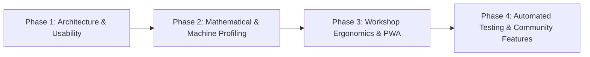

# UWGAS Project Plan & Roadmap

> **Universal Wet Grinder Angle Setter (UWGAS)**
> *Living roadmap, job schedule, and backlog. Update this file continuously to track project state across AI sessions.*

---

## 📋 Active Job Schedule & Backlog

| Job ID | Feature / Task | Status | Priority | Description & Next Action |
| :--- | :--- | :--- | :--- | :--- |
| **JOB-001** | `App.tsx` Modular Decomposition | `[IN PROGRESS]` | **HIGH** | Decompose 2,900-line `App.tsx` into modular components (`src/components/calculator/`, `src/components/modals/`, `src/components/settings/`) to accelerate development and eliminate monolithic bloat. |
| **JOB-002** | First-Run & Default Progression UX | `[READY]` | **HIGH** | If `sessionSteps` is empty, auto-populate or provide a 1-click default grinding+honing progression so the user immediately sees calculated USB heights on initial load. |
| **JOB-003** | UI Exposure for MicroBump ($\Delta\beta$) | `[READY]` | **HIGH** | Add interactive toggle & degree adjuster in the Global Setup card for micro-bevels (+0.2°, +0.4°), connecting to existing math engine support. |
| **JOB-004** | Direct $h_n \leftrightarrow h_r$ Height Mode Toggle | `[READY]` | **HIGH** | Place a quick pill toggle in the Calculator header for switching between datum base height ($h_n$) and wheel surface height ($h_r$) without digging into settings. |
| **JOB-005** | Workshop Steppers & Quick Angle Chips | `[READY]` | **HIGH** | Add touch-friendly $+/-$ stepper buttons for Projection $A$ ($\pm 1\text{mm}$, $\pm 5\text{mm}$) and Angle $\beta$ ($\pm 0.5^\circ$, $\pm 1.0^\circ$) plus quick-pick angle chips (15°, 17°, 20°, 25°). |
| **JOB-006** | Multi-Machine Profiles System | `[PROPOSED]` | **MEDIUM** | Store multiple grinder configs (e.g. "T-8 Shop", "T-4 Mobile", "Jet Clone") with individual USB diameters and calibration offsets. |
| **JOB-007** | Built-in Jig Catalog & Projection Calc | `[PROPOSED]` | **MEDIUM** | Provide jig presets (SVM-45, KJ-45 centering jig, etc.) and knife clamp projection calculators (blade width + clamp depth $\rightarrow A$). |
| **JOB-008** | Wheel Wear & Trueing Logger | `[PROPOSED]` | **LOW** | Track wheel diameter reduction over time with trueing cut notes and quick $\Delta D$ adjustment. |
| **JOB-009** | Large Readout Workshop HUD Mode | `[PROPOSED]` | **MEDIUM** | Fullscreen high-contrast view with massive $h_n$ readouts designed for viewing from 2 meters away while at the grinding wheel. |
| **JOB-010** | Vitest Math Engine Unit Tests | `[PROPOSED]` | **MEDIUM** | Golden-master test suite validating Ton math against canonical Dutchman spreadsheet tables. |

---

## 🎯 Project Vision

UWGAS is a precision angle calculator and sharpening workflow companion designed for Tormek and clone wet grinders (e.g., Jet, Scheppach, Wen, Triton). It utilizes the **Dutchman / Ton** trigonometry formulas to calculate exact Universal Support Bar (USB) heights ($h_n$ and $h_r$) for arbitrary wheel diameters, jig configurations, projections, and target bevel angles.

### Core Principles
1. **Mathematical Precision**: Accurate to sub-millimeter measurements; rigorous calibration solving for machine constants ($h_c, o$).
2. **Shop Ergonomics**: Designed for mobile and tablet use at the workbench (large touch targets, high contrast, quick progression navigation).
3. **Zero Lock-In / Privacy-First**: 100% client-side PWA with offline support, local storage persistence, and full JSON import/export.
4. **Modularity & Maintainability**: Clean separation between mathematical engine, state management, and UI presentation.

---

## 📊 Current Status (v0.9.0)

- [x] Dutchman / Ton core trigonometry solver (`src/math/tormek.ts`)
- [x] Dual-base machine calibration wizard with least-squares / non-linear solver and residual analysis ($\varepsilon$)
- [x] Multi-wheel progression list with per-step angle bump, grit labels, and base side toggles (Front / Rear)
- [x] Session presets management (create, apply, overwrite, delete)
- [x] Local storage persistence with schema versioning (`src/state/storage.ts`)
- [x] Theme Lab with live CSS variable manipulation and preset switching
- [x] Interactive dev console shell script (`angle-dev-console.sh`) with auto-checking and GitHub Pages deployment
- [x] PWA web manifest and offline service worker integration

---

## 🗺️ Roadmap & Milestones

### Phase 1: Architecture & Core Usability (Active Milestone)
*Objective: Decompose monolithic `App.tsx` and ensure immediate, frictionless bench usability.*

- [-] **1.1 Component Modularization (`JOB-001`)**
  - [x] Modal shell abstraction (`ModalShell.tsx`)
  - [ ] Global setup card (`GlobalSetupCard.tsx`)
  - [ ] Progression editor & steps (`ProgressionEditor.tsx`)
  - [ ] Wheel manager & form fields (`WheelManagerModal.tsx`, `WheelFormFields.tsx`)
  - [ ] Preset manager & save dialog (`PresetManagerModal.tsx`, `SavePresetModal.tsx`)
  - [ ] Machine constants view (`MachineConstantsCard.tsx`)
- [ ] **1.2 First-Run & Default Progression Flow (`JOB-002`)**
- [ ] **1.3 Surface MicroBump Controls (`JOB-003`)**
- [ ] **1.4 Direct Height Mode Toggle ($h_n \leftrightarrow h_r$) (`JOB-004`)**
- [ ] **1.5 Workshop Touch Steppers & Angle Chips (`JOB-005`)**

---

### 📝 Decision Log & Session History

| Date | Topic / Change | Rationale / Notes |
| :--- | :--- | :--- |
| **2026-08-25** | Active Job Schedule & Backlog Established | Introduced standardized job tracking (`JOB-xxx` IDs with explicit statuses) to maintain continuity across all AI agent sessions. |
| **2026-08-25** | Project documentation system established | Created `PROJECT_PLAN.md`, `ARCHITECTURE.md`, `DEVELOPMENT_GUIDE.md` for cross-session continuity. |
| **2025-12-19** | Dev Console & Automated Deployment | Added `angle-dev-console.sh` with live dynamic status, QR codes, quality prechecks, and `gh-pages` deployment. |
| **2025-12-18** | Rebuilt core math & UI baseline | Restored Dutchman/Ton math engine, PWA manifest, and stable state persistence. |
