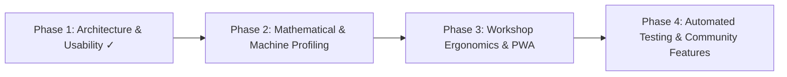

# UWGAS Project Plan & Roadmap

> **Universal Wet Grinder Angle Setter (UWGAS)**
> *Living roadmap, job schedule, backlog, and issue tracker. Update this file continuously to track project state across AI sessions.*

---

## 📋 Active Job Schedule & Backlog

| Job ID | Feature / Task | Status | Priority | Description & Next Action |
| :--- | :--- | :--- | :--- | :--- |
| **JOB-008** | Large Readout Workshop HUD Mode | `[PROPOSED]` | **MEDIUM** | Fullscreen high-contrast view with massive $h_n$ readouts designed for viewing from 2 meters away while at the grinding wheel. |
| **JOB-009** | Vitest Math Engine Unit Tests | `[PROPOSED]` | **MEDIUM** | Golden-master test suite validating Ton math against canonical Dutchman spreadsheet tables ([`docs/MATH_REFERENCE.md`](MATH_REFERENCE.md)). |
| **JOB-010** | Wheel Wear & Trueing Logger | `[PROPOSED]` | **LOW** | Track wheel diameter reduction over time with trueing cut notes and quick $\Delta D$ adjustment. |
| **JOB-015** | Direct Swap / Unadjusted Angle Calculator | `[PROPOSED]` | **LOW** | Add UI to display the exact angle hit when swapping wheels on the same base without adjusting the USB nut. The mathematical solver (`solveBetaForFixedSetup`) is already implemented in `tormek.ts`. |
| **JOB-021** | Gesture-Based Step Reordering (Drag and Drop) | `[PROPOSED]` | **MEDIUM** | Implement native-feeling touch drag-and-drop reordering for the Progression list (e.g. using `@dnd-kit`), adding drag handles to avoid clicking up/down buttons. |
| **JOB-028** | Full Hardware API Integration (Roadmap) | `[PROPOSED]` | **MEDIUM** | Extend initial `History API` back-button trap to full native hardware integration. Explore potential integrations with digital angle cubes (via WebBluetooth/WebUSB), digital calipers, physical keyboard steppers, or haptic feedback. |
| **JOB-029** | Refine Versioning Logic | `[PROPOSED]` | **HIGH** | Discuss and implement bumping the version at the time of merging `dev` to `main`, and updating the build number on commits based on diffs. |

---

## 🐛 Known Issues & Bench Feedback Tracker

| Issue ID | Severity | Status | Description & Reproduction | Resolution / Target Job |
| :--- | :--- | :--- | :--- | :--- |
| *No open bugs* | — | — | All current quality gates and build prechecks are passing with 0 errors. | — |

---

## 🎯 Project Vision

UWGAS is a precision angle calculator and sharpening workflow companion designed for Tormek and clone wet grinders (e.g., Jet, Scheppach, Wen, Triton). It utilizes the **Dutchman / Ton** trigonometry formulas to calculate exact Universal Support Bar (USB) heights ($h_n$ and $h_r$) for arbitrary wheel diameters, jig configurations, projections, and target bevel angles.

### Core Principles
1. **Mathematical Precision**: Accurate to sub-millimeter measurements; rigorous calibration solving for machine constants ($h_c, o$).
2. **Shop Ergonomics**: Designed for mobile and tablet use at the workbench (large touch targets, high contrast, quick progression navigation).
3. **Zero Lock-In / Privacy-First**: 100% client-side PWA with offline support, local storage persistence, and full JSON import/export.
4. **Modularity & Maintainability**: Clean separation between mathematical engine, state management, and UI presentation.

---

## 📊 Current Status (v0.9.5)

- [x] Dutchman / Ton core trigonometry solver (`src/math/tormek.ts`)
- [x] Dual-base machine calibration wizard with least-squares / non-linear solver and residual analysis ($\varepsilon$)
- [x] Multi-wheel progression list with per-step angle bump, grit labels, and base side toggles (Front / Rear)
- [x] Session presets management (create, apply, overwrite, delete, rename)
- [x] Local storage persistence with schema versioning (`src/state/storage.ts`)
- [x] Theme Lab with live CSS variable manipulation and preset switching
- [x] Interactive dev console shell script (`angle-dev-console.sh`) with auto-checking and GitHub Pages deployment
- [x] PWA web manifest and offline service worker integration
- [x] Modular component architecture with clean domain separation
- [x] Workshop touch steppers, quick angle chips, and direct $h_n \leftrightarrow h_r$ mode pill

---

## 🗺️ Roadmap & Milestones

### Phase 1: Architecture & Core Usability (Completed ✓)
*Objective: Decompose monolithic `App.tsx` and ensure immediate, frictionless bench usability.*

- [x] **1.1 Component Modularization (`JOB-001`)**
  - [x] Modal shell abstraction (`ModalShell.tsx`)
  - [x] Global setup card (`GlobalSetupCard.tsx`)
  - [x] Progression editor & steps (`ProgressionEditor.tsx`)
  - [x] Wheel manager & form fields (`WheelManagerView.tsx`, `WheelFormFields.tsx`)
  - [x] Preset manager & save dialog (`PresetManagerModal.tsx`, `SavePresetDialog.tsx`)
  - [x] Machine constants view (`MachineConstantsCard.tsx`)
- [x] **1.2 First-Run & Default Progression Flow (`JOB-002`)**
- [x] **1.3 Surface MicroBump Controls (`JOB-003`)**
- [x] **1.4 Direct Height Mode Toggle ($h_n \leftrightarrow h_r$) (`JOB-004`)**
- [x] **1.5 Workshop Touch Steppers & Angle Chips (`JOB-005`)**

---

### Phase 2: Multi-Machine Profiles & Advanced Grinding Features (Next Milestone)
*Objective: Expand the math and configuration engine to handle multi-machine setups, alternative jigs, and advanced geometry.*

- [x] **2.1 Multi-Machine Profile Management (`JOB-006`)**
- [x] **2.2 Jig & Knife Projection Helpers (`JOB-007`)**
- [ ] **2.3 Large Readout Workshop HUD Mode (`JOB-008`)**

---

### 📝 Decision Log & Session History

| Date | Topic / Change | Rationale / Notes |
| :--- | :--- | :--- |
| **2026-09-06** | Defined Viewport Targets (`JOB-011`) | Standardized minimum supported viewport at 360px (base Android) with guidelines to minimize overlap/wrapping, and 390px as the comfortable target (iPhone 13+/Pixel). |
| **2026-09-03** | Completed Modern Sleek Dark Theme UI Refactor (`JOB-022`) | System-wide visual overhaul across all modals, dialogs, managers, settings views, calibration wizard, glossary, and setup drawer to establish 100% aesthetic consistency with `ProgressionView.tsx` dark zinc/amber design tokens (`bg-[#262626]`, `border-white/10`, `rounded-3xl`, responsive scaling). Pass all typecheck, lint, and build verification gates with 0 errors. |
| **2026-09-01** | Completed Built-in Jig Catalog & Projection Calc (`JOB-007`) | Added Protrusion ($P_b$) mode to the Global Setup card. Expanded Hardware Settings to include Jig Base Length, Adjustable Collar toggle, and Thread Pitch. Included automated projection-to-protrusion solver output indicating exact Jig collar mm and turns to hit a target angle in Projection Solver mode. Relocated Reference Base toggle to App Settings. |
| **2026-08-28** | Completed Suggested Front USB Height (`JOB-014`) | Added pure geometric solver matching axle-to-USB distance ($CA$) between front and rear bases in Projection Mode so projection $A$ remains identical across matched wheel operations without reclamping. Cleaned UI with high-contrast text readout, custom setting checkbox override, and removed front steppers. |
| **2026-08-27** | Completed Projection Solver Mode (`JOB-012`) | Implemented exact closed-form algebraic inverse Dutchman solver to calculate required knife projection $A$ with fixed USB bar position ($h_n / h_r$). Added header toggle button and responsive workshop steppers. |
| **2026-08-26** | Completed Phase 1 Core Usability & Decomposition | Decomposed `App.tsx` into modular components, added touch steppers, quick angle chips, MicroBump controls, $h_n \leftrightarrow h_r$ pill, and default progression auto-loader. Verified with clean build. |
| **2026-08-25** | Active Job Schedule & Backlog Established | Introduced standardized job tracking (`JOB-xxx` IDs with explicit statuses) to maintain continuity across all AI agent sessions. |
| **2026-08-25** | Project documentation system established | Created `PROJECT_PLAN.md`, `ARCHITECTURE.md`, `DEVELOPMENT_GUIDE.md` for cross-session continuity. |
| **2025-12-19** | Dev Console & Automated Deployment | Added `angle-dev-console.sh` with live dynamic status, QR codes, quality prechecks, and `gh-pages` deployment. |
| **2025-12-18** | Rebuilt core math & UI baseline | Restored Dutchman/Ton math engine, PWA manifest, and stable state persistence. |
